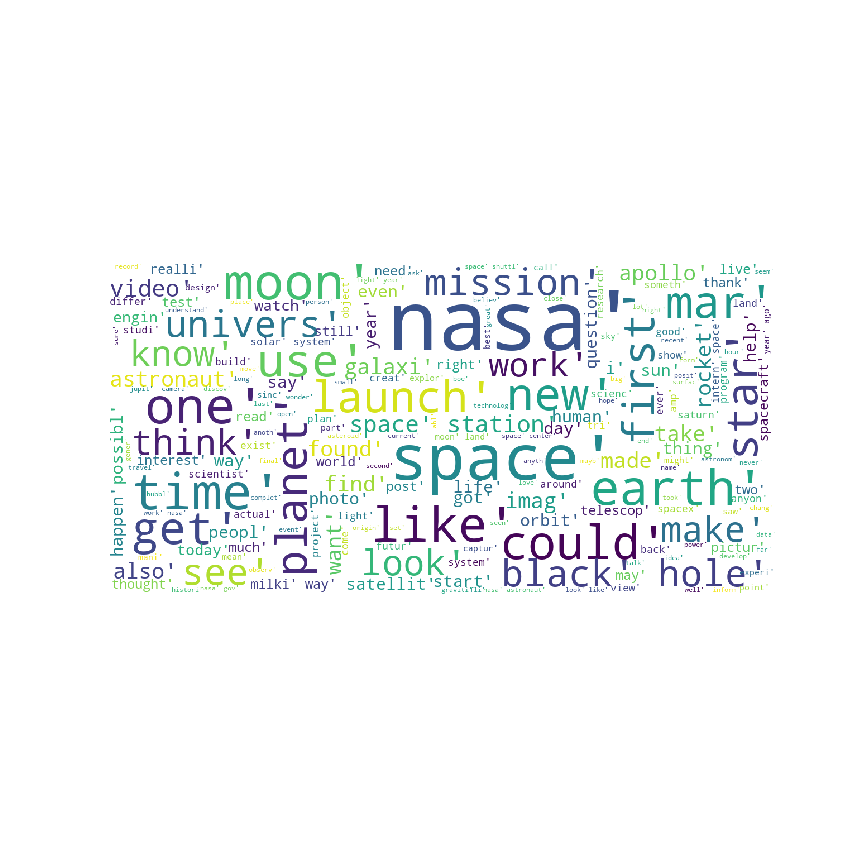
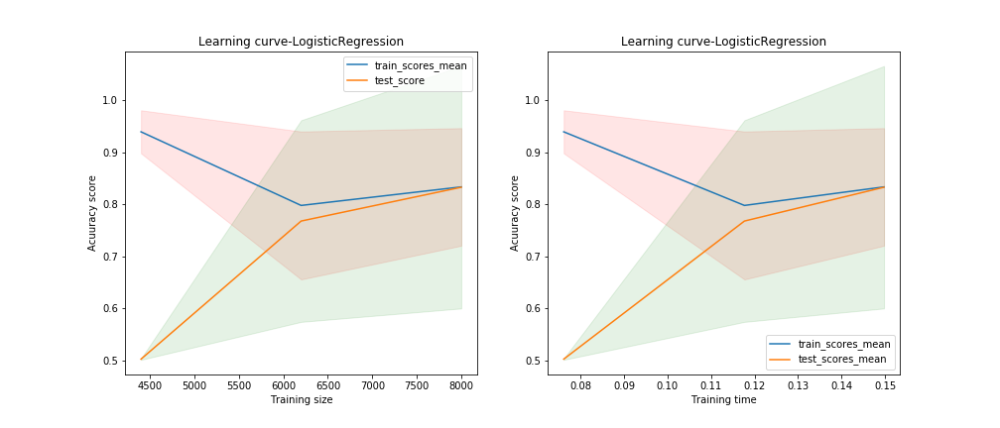
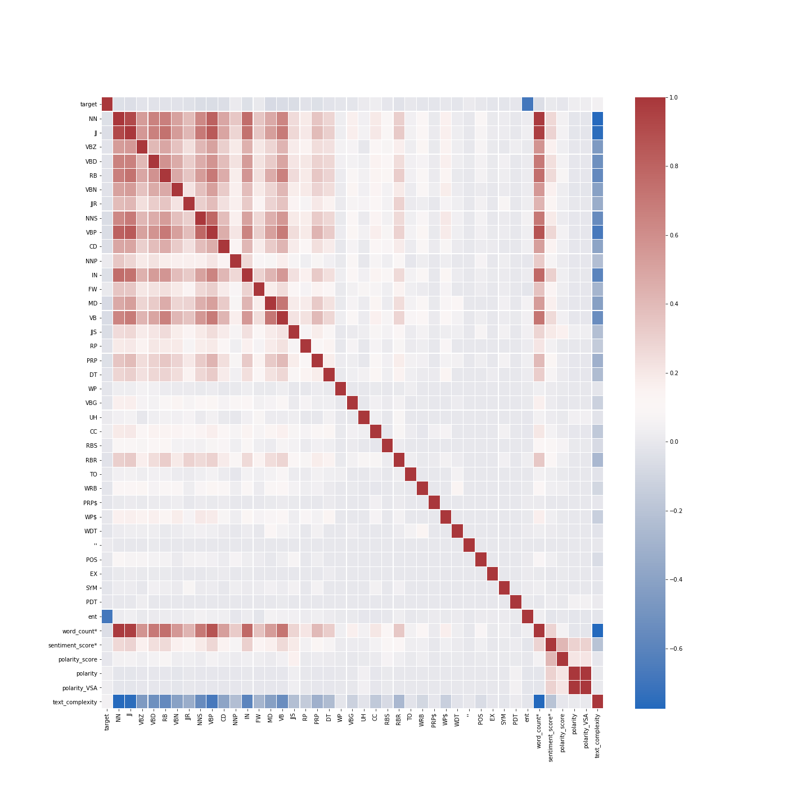

<p align="center">
  
</p>

# Binary Class Classification (NASA and Space) on Reddit data using NLP

### Project Name:
Binary Class Classification (NASA and Space) on Reddit data using NLP


### Description:
Space was always my passion and I love observing stars, galaxies, solar systems with binocular.
The [NASA](https://www.reddit.com/r/nasa/) community is for anything related to the National Aeronautics and Space Administration; the latest news, events, current and future missions, and more.
It has 1.3m Members with 282 IN SPACE and it was created on Jul 17, 2008.
The [Space Discussion](https://www.reddit.com/r/space/) is a community for sharing & discussing informative content on: * Astrophysics * Cosmology * Space Exploration * Planetary Science * Astrobiology. It has 17.2m
Members, 5.0k Online, and it were created Jan 26, 2008.
The goal is to develop a binary class classification that would be able to recognize the Nasa community from Space Discussion. 
These two close categories were selected to rise the challenge and see how close we can get using common ML algorithm libraries in python.

### Table of Contents:
The project directory tree structure is provided below.
```
├── Assets
├── Codes
│   ├── Models
│   ├── P01_Gathering_Data.ipynb
│   ├── P02_Cleaning_Data.ipynb
│   ├── P03_Exploratory_Data_Analysis.ipynb
│   ├── P04_01_Modeling.ipynb
│   ├── P04_02_Modeling.ipynb
│   └── P04_03_Voting_Modeling.ipynb
├── DataSet
├── Figures
├── Functions
├── Images
├── LICENSE
└── README.md
```

### Installation:

* To run this project you need to have python installed on your local machine. At the moment the project is not come with the env but I will make an env using conda and will add to the directory. check for updates.  Also, I may provide a docker image for this project too. So stay tuned!
I also prepare a medium about how you can use docker image and Jupyter notebook [here](https://medium.com/@atashnezhad1/in-this-tutorial-we-will-learn-the-very-basics-of-running-the-jupyter-notebook-using-docker-9b347c9058d9).
* List of my global libraries is provided as ```requirements.txt``` file in the env folder, therefore you may use ```pip install -r requirements.txt ``` to install all necessary libraries with no hassle.
* 
### Instruction:

* Gathering data: Data was received using the API from the Reddit website for two categories. I used my friend [Saied](https://github.com/saiedmighani/Global_warming_NLP_analysis/blob/master/assets/get_reddit_posts.py) function with a little bit of change to recieve data from Reddit. You may check out the original function [here](https://github.com/scaress21/reddit_and_quibi/blob/master/code/01A_Gathering_Reddit_Data.ipynb).
the data was save in two formats .csv and .pkl.

* Cleaning data: 
the data included 10-15 columns with one column with reddit comments as text. The NaN values were filtered and the text was cleaned using a serious of functions including tokenization, splitting, snitching, removing stop words, stemming, etc.


<p align="">
  
  
  
</p>


<p align="">
  
</p>


<p align="center">
  
</p>


<p align="center">
  
</p>


<p align="center">
  
</p>


