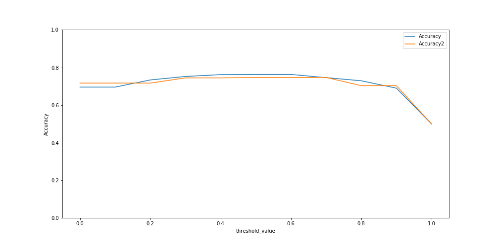
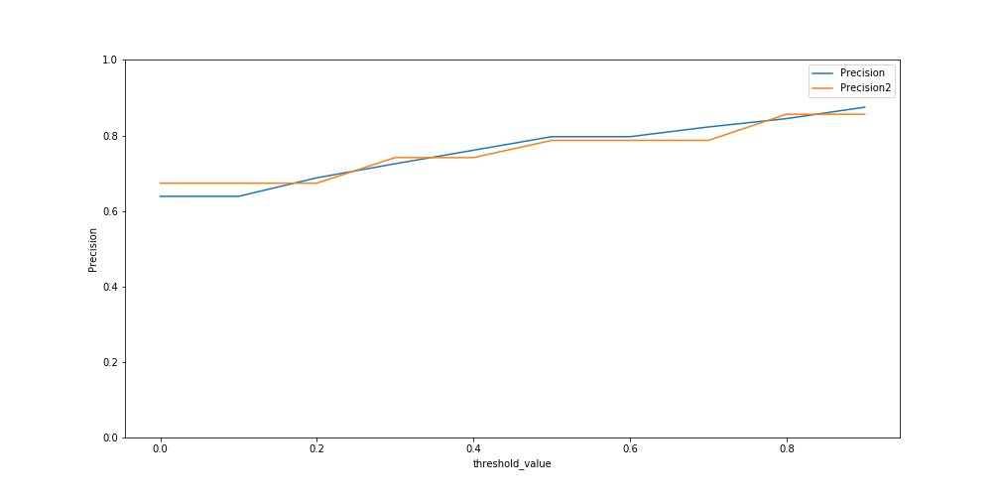
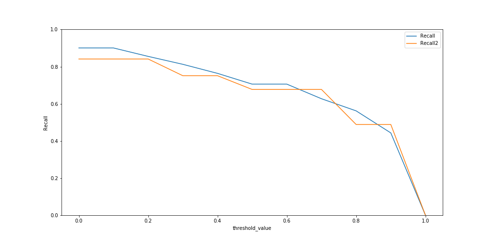

# Binary Class Classification (NASA and Space) on Reddit data using NLP

  

Space was always my passion and I love observing stars, galaxies, solar system with binocular.

The [NASA](https://www.reddit.com/r/nasa/) community is for anything related to the National Aeronautics and Space Administration; the latest news, events, current and future missions, and more.
It has 1.3m Members with 282 IN SPACE and it was created on Jul 17, 2008.

The [Space Discussion](https://www.reddit.com/r/space/) is a community for sharing & discussing informative content on: * Astrophysics * Cosmology * Space Exploration * Planetary Science * Astrobiology. It has 17.2m
Members, 5.0k Online and it was created Jan 26, 2008.

The goal is to develope a binary class classification which would be able to recongnize the Nasa community from Space Discussion. These two were chose similar to test the classification methods power.

[above picture](https://spacenews.com/artificial-intelligence-arms-race-accelerating-in-space/) 

### Gather data - Part 1
* write a function to gather data using API from the Reddit website.

---
### Clean data - Part 2
* Select your columns.
* replace NAN values (i.e. using fillna function) and merge texts if necessary.
* write a function to do regex analysis and do some editing on texts including:
	* Removing "\n" characters
	* Removing the [removed] characters
	* Use regular expressions to do a find-and-replace
	* Making all characters lower case
	* Replacing multiple spaces
	* Removing stopwords
	* Instantiate object of class PorterStemmer and stemming
	* Adding space to stitch the words together
* Merge two subset data (NASA and Space) to one.

---
### EDA - Part 3
* Count the number of words on the text and add a new column with the number of words.
* Apply sentiment analyzer on each text and add it as a new column.
* separate the date and add it to data (using utc --> data).
* turn subreddit column to numeric values (0,1).
* drop column "domain".
* check the column and make sure dtype is correct. in this case change the column "over_18" dtype from object to int.
* pairplot based on target value and save the figures in the Figure folder.
* check out if there is any clear correlation between the independent parameters using ".corr()" function. plot the correlation and save it in the figure folder.
* check out and plot the correlation between post length and sentiment score for targets.
* engineering new variables and check out if they improve the .corr values. note the dtype! only numerics are used in ".corr" function.
* use stop words and add new stop words to list, fit_transform the data on text_merged column (just checked here).

---
### ML algorithms - Part 4
* value count and hist the target value
* For now we use two columns and will check out the accuracy and other metrics. if the results were not promising then we will add more independent variables. select "target" and "text_merged" as y and x variables and split.
* count vectorize the x train values using fit_transform function, turn it to df.
* check out the most frequent words. see what words are used more. check out the top 10 words and plot.
* apply stopword list and extend it if it is necessary.
* apply logistic regression model as a base model.
* check out the coefficients of lr model.
* question is that if the way we selected cvec paramteres to vectorize the data is optimum? does it affect the results and accuracy? how can we find a better paramters? solution: develope a pipe line and grid search it and find the best paramters.
solution2: use metahurestic algorithm to find the best paramters as we did [here](https://github.com/Atashnezhad/XGBoost_Hyperparameters_Tuning)

	* In this study we will do grid search using pipe line.
	* Apply logistic regression model.
	* Apply Naïve Bayes model along with MultinomialNB.
	* Apply Naïve Bayes model along with TFIDF.
	* Apply random forests.
	* Apply extra tress.
	* Apply gradient boost.
	* Apply NN.
	* Apply SVM.

---
### Discussion
---
* It is observed that TFIDF will a little bit help the ML algorithms to find better results. 
The accuracy, precision, and recall are over 70%. The trade-off effect between precision and recall is observed as it is expected. We will include the text and numeric columns and hopefully, we increase the overall metrics. The ML algorithm used in this case is overfitting the data (high accuracy on train data set and lower accuracy on test data set).
---
The above algorithms were used in the shape of an ensembled model to see it will affect the performance. The accuracy, Precision, and recall criteria were used and plotted versus different threshold values.
The results were plotted.

  
  
  
  

So depending on what criteria is the goal one can ensemble algorithms and select a threshold value to hit the goal. Accuracy seems constant no matter what threshold value is selected, however for high recall, 
one should select low threshold values for the ensembled algorithm. similarly one can improve the Precision by selecting high threshold values.

