<p align="center">
  
</p>

# Binary Class Classification (NASA and Space) on Reddit data using NLP

### Project Name:
Binary Class Classification (NASA and Space) on Reddit data using NLP


### Description:
Space was always my passion and I love observing stars, galaxies, solar systems with binocular.
The [NASA](https://www.reddit.com/r/nasa/) community is for anything related to the National Aeronautics and Space Administration; the latest news, events, current and future missions, and more.
It has 1.3m Members with 282 IN SPACE and it was created on Jul 17, 2008.
The [Space Discussion](https://www.reddit.com/r/space/) is a community for sharing & discussing informative content on: * Astrophysics * Cosmology * Space Exploration * Planetary Science * Astrobiology. It has 17.2m
Members, 5.0k Online, and it were created Jan 26, 2008.
The goal is to develop a binary class classification that would be able to recognize the Nasa community from Space Discussion. 
These two close categories were selected to rise the challenge and see how close we can get using common ML algorithm libraries in python.

### Table of Contents:
The project directory tree structure is provided below.
```
├── Assets
├── Codes
│   ├── Models
│   ├── P01_Gathering_Data.ipynb
│   ├── P02_Cleaning_Data.ipynb
│   ├── P03_Exploratory_Data_Analysis.ipynb
│   ├── P04_01_Modeling.ipynb
│   ├── P04_02_Modeling.ipynb
│   └── P04_03_Voting_Modeling.ipynb
├── DataSet
├── Figures
├── Functions
├── Images
├── LICENSE
└── README.md
```

### Installation:

* To run this project you need to have python installed on your local machine. At the moment the project does not come with the env but I will make an env using conda and will add it to the directory. check for updates.  Also, I may provide a docker image for this project too. So stay tuned!
I also prepare a medium about how you can use docker image and Jupyter notebook [here](https://medium.com/@atashnezhad1/in-this-tutorial-we-will-learn-the-very-basics-of-running-the-jupyter-notebook-using-docker-9b347c9058d9).
* List of my global libraries is provided as ```requirements.txt``` file in the env folder, therefore you may use ```pip install -r requirements.txt ``` to install all necessary libraries with no hassle.

* Also use following to find the executable whenver you had hard time to install libraries.
```python
import sys
print(sys.executable)
```
Then use following to install favorite libraries (i.e. wordcloud).
```python
!/Users/amin/anaconda3/bin/python -m pip install wordcloud
```
I used it several times in Part_03 of this project and it works like charm!
### Instruction:

**Gathering data:** 

Data was received using the API from the Reddit website for two categories. I used my friend [Saied](https://github.com/saiedmighani/Global_warming_NLP_analysis/blob/master/assets/get_reddit_posts.py) function with a little bit of change to receive data from Reddit. You may check out the original function [here](https://github.com/scaress21/reddit_and_quibi/blob/master/code/01A_Gathering_Reddit_Data.ipynb).
the data was save in two formats .csv and .pkl.

**Cleaning data:** 
Data included 10-15 columns with one column with Reddit comments as text. The NaN values were filtered and the text was cleaned using a series of functions including tokenization, splitting, snitching, removing stop words, stemming, etc.

**Exploratory Data Analysis:** 

The main data frame was analyzed and the following were observed.

- It is seen that both categories are pretty close. Space has a higher percentage of 'link', 'rich:video', and 'self' while Nasa has more 'image' numbers.
- Again It is seen that both categories are pretty close in terms of 'over_18'. a higher number of people in space answered 'False' to the column 'over_18'.
NASA has a lower average word count compare to Space with a smaller standard deviation. let's look at the plt.hist and compare it with space. A similar plot provided above but here bar plots are side by side.
- Both subcategories are pretty close in terms of word count. However, the space category has some long texts above 500.
- For the sentiment score, it is seen that both mean and std are pretty close. It seems both SPACE and NASA forums are pretty close! Let's plot both NASA and space.
- It is seen that the negative sentiment scores for space are a little bit higher than NASA. People who are in NASA discussion have a more positive attitude compared to people who are in space discussion. Let's double-check it and do the summation of sentiments for both space and NASA. Also, the Space has more words compare to NASA.
- Let's focus on text and do count vectorize on data. Three steps are taken as follows:
  - Add some stop words to the general list
  - Apply the new list of stop words list (extend)
  - Apply count vectorize to the data

- Let's see the top words in NASA, SPACE, and then see the top overlap words.
  - As it is seen these two topics are very close! The top words for NASA are space, earth, NASA, moon which have three out of four similar to space.
- Check out the Number of characters present in each sentence.
- Average word length in each sentence. Again both topics are pretty close in term of average word length, sentiment score and, number fo characters.
<p align="center">
  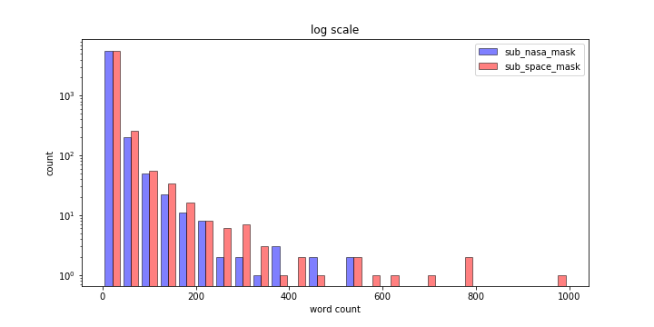
</p>

<p align="center">
  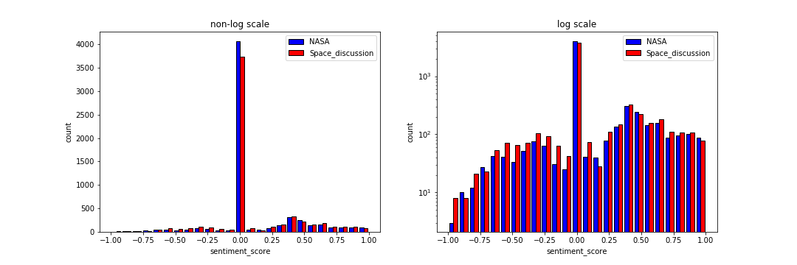
</p>

- Inspect which words other than stopwords occur frequently.
<p>
  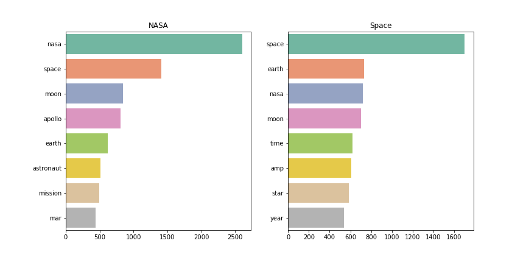
</p>

- Topic Modeling exploration with pyLDAvis.
  - The unsupervised correctly detect two main subjects as we expected (high Coffs for NASA and Space). NASA and Space!
- Textblob libraries. sentiment polarity was applied.
- Vader Sentiment Analysis was applied too. Vader works better in detecting negative sentiment.
- Named Entity Recognition (ner). Named entity recognition is an information extraction method in which entities that are present in the text are classified into predefined entity types like “Person”,” Place”,” Organization”, etc. By using NER we can get great insights into the types of entities present in the given text dataset. A powerful correlation between enr and target values was observed.
<p align="">
  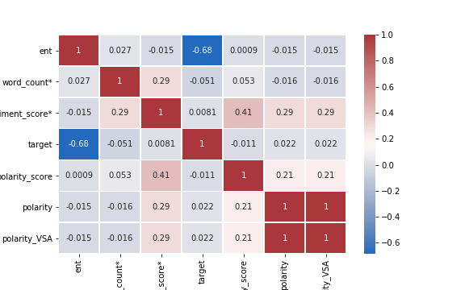
</p>

- Exploration through Parts of Speach Tagging in python.
- Exploring through text complexity.
<p align="">
  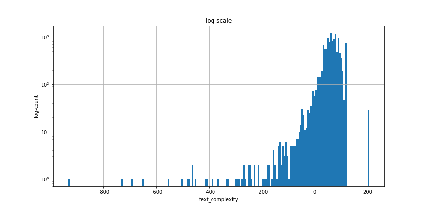
</p>
Again it was observed that both categories are match in term of complexity.
<p align="">
  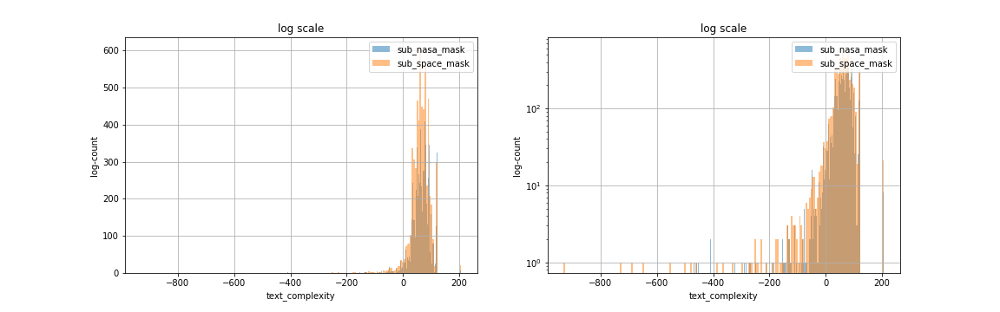
</p>

- Following columns were selected and save seperatly as EDA df.
  - cols = 'ent', 'word_count*', 'sentiment_score*', 'polarity_score', 'polarity','polarity_VSA', 'text_complexity'

- EDA df corrolation is see at the following figure. Again it is observed that there is clear coorrolation between ent parameter and target.
<p align="">
  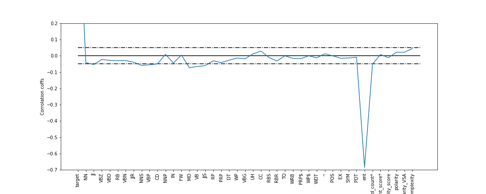
</p>

- Three set of data frames were prepared including count-vectorized texts, EDA data frame and, merged count-vectorized text and EDA data.


**Modeling-ML algorithms:** 

- Several ML algorithms applied to three sets of the data frames. 
- Logistic Regression, Gradient Boosting Classifier and, MLP Classifier were applied.
- Models were grid searched using parallel computing to achieve the highest speed.
- The voting system included three best models along with hyper-parameters were applied which results in maximum accuracy of 96%.
- It was observed that using only vectorized text results in lower accuracy compared to the EDA data set. Also using merged data set results in top accuracy. 
- Check out the following confusion matrixes. The left one is using Logistic Regression on vectorized data while at the right the Soft voting model used on All_df.
<p align="">
  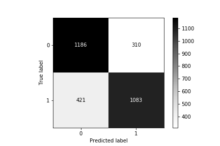
  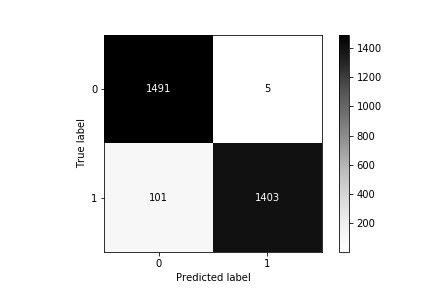
</p>


- Progress in modeling accuracy is seen in the following figure.
<p align="">
  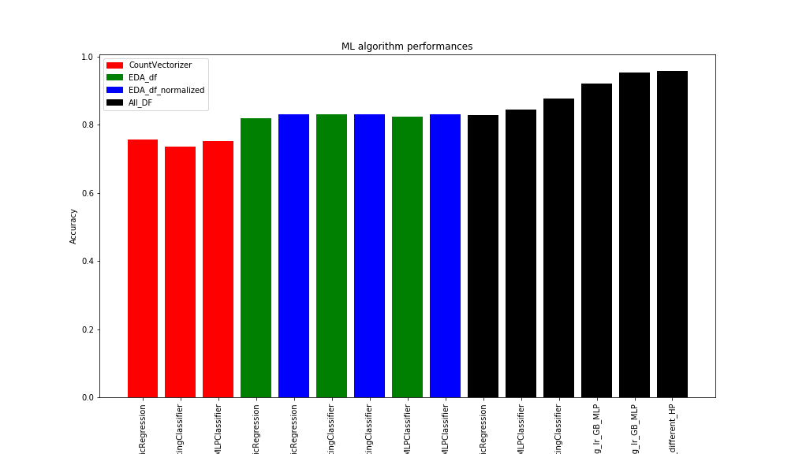
</p>

  

**Conclusion**

- The best model is the soft voting model including the three best ML algorithms which were achieved through grid search.
- In this project, a new set of data were extracted which later used for modeling. The analysis shows that a new engineered set of data (EDA) shows higher accuracy and boosts the ML algorithms.
- Merging both vectorized text and Engineered data set (EDA) even helps more and boosts the accuracy above 80%.
- Finally having an ensemble model works the best with an accuracy of 96%.
```
|    | model_name                         | data_set_used     |   accuracys |   TN |   FP |   FN |   TP |
|----|------------------------------------|-------------------|-------------|------|------|------|------|
|  0 | LogisticRegression                 | CountVectorizer   |       0.756 | 1186 |  310 |  421 | 1083 |
|  1 | GradientBoostingClassifier         | CountVectorizer   |       0.736 | 1288 |  208 |  578 |  926 |
|  2 | MLPClassifier                      | CountVectorizer   |       0.752 | 1149 |  347 |  381 | 1123 |
|  3 | LogisticRegression                 | EDA_df            |       0.82  | 1456 |   40 |  495 | 1009 |
|  4 | LogisticRegression                 | EDA_df_normalized |       0.832 | 1496 |    0 |  504 | 1000 |
|  5 | GradientBoostingClassifier         | EDA_df            |       0.831 | 1495 |    1 |  504 | 1000 |
|  6 | GradientBoostingClassifier         | EDA_df_normalized |       0.831 | 1495 |    1 |  504 | 1000 |
|  7 | MLPClassifier                      | EDA_df            |       0.824 | 1470 |   26 |  491 | 1013 |
|  8 | MLPClassifier                      | EDA_df_normalized |       0.832 | 1488 |    8 |  499 | 1005 |
|  9 | LogisticRegression                 | All_DF            |       0.828 | 1458 |   38 |  476 | 1028 |
| 10 | MLPClassifier                      | All_DF            |       0.844 |  nan |  nan |  nan |  nan |
| 11 | GradientBoostingClassifier         | All_DF            |       0.878 |  nan |  nan |  nan |  nan |
| 12 | Hard_voting_lr_GB_MLP              | All_DF            |       0.921 | 1481 |   15 |  220 | 1284 |
| 13 | Soft_voting_lr_GB_MLP              | All_DF            |       0.954 | 1491 |    5 |  101 | 1403 |
| 14 | Soft_voting_lr_GB_MLP_different_HP | All_DF            |       0.959 | 1493 |    3 |  128 | 1376 |
```
<p align="center">
  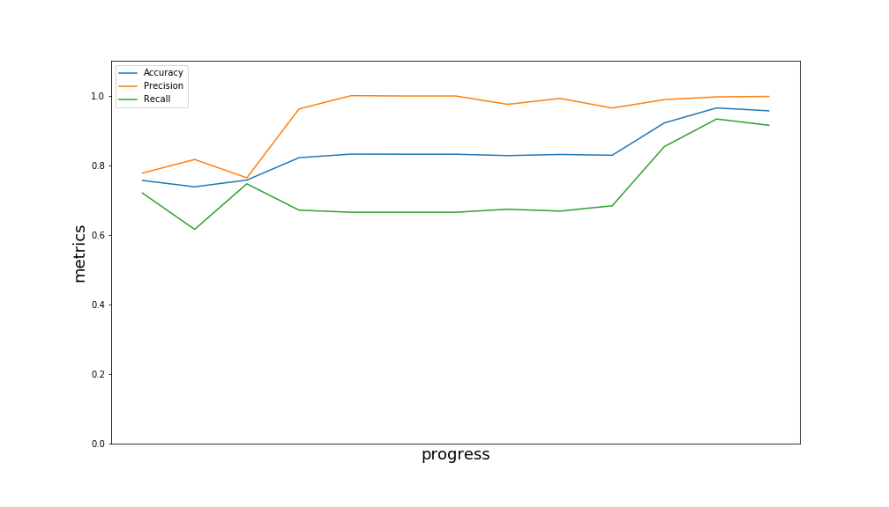
</p>


**Suggestions**

- TFIDF vectorizer can be studied and see if it helps the accuracy of models.
- In voting ML algorithm more model can be introduced which it would help for sure.
- The goal of this project was to make a challenge and check out how much we can get close to text classification using common python libraries.


